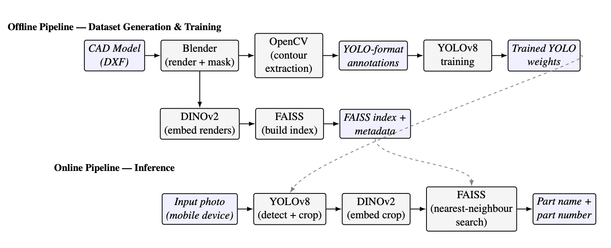

# CAD-to-Real Object Recognition

A computer vision pipeline that identifies real-world objects from a single photograph, using only their CAD models. No photos of the physical object are required to teach the system to recognize it.

## What This Solves

Many objects, especially in manufacturing environments, have no reliable way to be identified by sight alone. No barcode, label, or unique marking. If you have a CAD model of an object, this system lets you generate synthetic training data automatically and then identify that object from a real photo (for example, taken with a phone camera), without ever needing to photograph the real object beforehand.

This makes it useful anywhere physical labelling isn't practical, for example, unlabelled parts in a manufacuring environment.

## How It Works

The system is split into two pipelines: an **offline pipeline** that runs once per object (or batch of objects) to prepare training data and/or a searchable reference index, and an **online pipeline** that runs every time someone photographs an object.



### Why Two Models Instead of One

The system intentionally splits two jobs that was previously done by a single model:

**YOLOv8 — detection only.** YOLO is trained as a **single-class detector**. Its only job is to determine if an object of interest exists in an image, and where. This works well for related objects, like manufacturing components where the object pool consists of brackets, valves, tools, frames, and other likewise shaped/textured objects. YOLO will no longer know the exact object being identified; that identifaction process has been offloaded to DINO and FAISS. Once YOLO successfully segments (isolates) the object in an image, it passes that cropped region containing the object to the next stage to be identified.

**DINOv2 + FAISS — identification.** DINOv2 is a pre-trained vision transformer (Meta), with no fine-tuning. It converts an image into a feature embedding, which is  a numerical fingerprint of what the object looks like. Every render in the training dataset has a fingerprint stored in a FAISS index. At inference time, the cropped object from YOLO is fingerprinted the same way, and FAISS returns the closest matching reference render from the training dataset. The label attached to that render (name, ID, or any identifier you choose) is returned as the result.

**Why Identification has been offloaded from YOLO:** Retraining YOLO on a new dataset without redoing the full training run isn't possible with the current setup. After the final epoch, weights are saved to best.pt, which is what the inference step calls. Training again overwrites best.pt entirely, producing a new set of weights specific to whatever dataset was just used. There's no way to incrementally add new datasets to the training path. This is why the system is designed to avoid retraining altogether for scalability. Adding a new object never requires retraining YOLO, since YOLO only needs to detect if an object is present, not which one. You simply render the new object and add its embeddings to the FAISS index.

### Note ###
Currenlty I am working on restructuring how DINO + FAISS retreive the reference image. Right now, the training dataset is also being used as the reference images. An additional Blender Python script is being developed to produce a ~50 image dataset per object added without color/angle/lighting randomization. This will eliminate having to generate a ~300 image dataset of each new object with unnecessary training specific functions like color/angle/lighting randomization.

## Repository Structure

```
.env                                 Environment variables (server config, not committed)
.gitignore
README.md

app/
  flask_server.py                    Flask server — runs the full inference pipeline, serves the web UI
  index.html                         Mobile web UI (camera capture (coming soon), confirm, result screens)
  requirements.txt                   Python dependencies for running the server
  test_identification_in_terminal.py
                                      CLI tool to test the pipeline on a single photo
                                      without the server/browser. Useful for isolating whether a
                                      problem is in detection (YOLO) or identification (DINOv2/FAISS)

assets/
  image.png                           Diagram displayed earlier in this README
  backgrounds/
    background_01.jpg ... n
                                      For fine-tuning YOLO.
                                      Add real-world background photos used to composite synthetic renders
                                      onto, reducing the domain gap between training data and real input

model/
  pyproject.toml                     Package metadata for the `pipeline` module
  README.md                          Model Pipeline Handbook
  pipeline/
    convert_cad_to_obj.py            Converts CAD files (DXF) into OBJ format for Blender
    generate_synthetic_dataset.py    Automates Blender rendering: randomized color, lighting, camera
                                      angle, and material per render; generates segmentation mask and
                                      YOLO-format annotation; writes metadata.json per object
    prepare_dataset_for_yolo.py      Composites renders onto background images, builds the train/val
                                      split and dataset.yaml required by YOLO
    train_yolo.py                    Fine-tunes YOLOv8s-seg as a single-class detector
    build_index_with_dino_and_faiss.py
                                      Embeds renders using DINOv2 and builds/updates the FAISS index;
                                      incremental — only processes renders not already indexed
    blender/
      events.py                      Forwards all Blender events
      extension_events.py            Ensures that Blender contains the desired extension
      material_events.py             Blender material events for segmentation mask
      object_events.py               Commonly used Blender object events (center, delete, join, etc.)
      render_settings.py             Blender image and engine render configurations
      scene_events.py                Blender scene events (camera, lighting, etc.)

runs/                                 YOLO training output (weights (best.pt), validation batches, confusion
                                       matrix, results.csv) — generated by train_yolo.py, not committed


myvenv/                               Python virtual environment (not committed)
```

> Note: `data/raw/`, `embeddings/`, and trained model weights are generated by the pipeline scripts and are not stored in version control.

## Setup

```bash
pip install -r app/requirements.txt
```

`requirements.txt` includes: `flask`, `ultralytics`, `transformers`, `faiss-cpu`, `torch`, `torchvision`, `pillow`, `numpy`.

> This project requires Blender installed with Python scripting access (or the `bpy` module available in your environment).

**Note:** this repository contains source code only. No training data, renders, embeddings, or trained model weights are included. They must be generated locally by following the steps below. This is intentional, since datasets and weights are typically large and often specific to proprietary objects.

### Environment Variables
 
Copy the example file and fill in your own local paths:
 
```bash
cp .env.example .env
```
 
| Variable | Description |
|----------|--------------|
| `MODEL_DATA_DIR` | Root directory for pipeline data (CAD/OBJ files, renders, trained models, embeddings). Subfolders (`dxf/`, `obj/`, `raw/`, `dataset/`, `models/`, `embeddings/`) are created/used automatically underneath it. |
| `MODEL_DATA_NUM_RENDERS` | Number of synthetic renders to generate per object. |
| `RAW_DATA_DIR` | Directory containing raw (uncomposited) renders, used when preparing the dataset for YOLO training. |
| `OUTPUT_DATA_DIR` | Directory where the prepared YOLO dataset (train/val split, `dataset.yaml`) is written. |
| `BACKGROUNDS_DIR` | Directory containing real-world background photos used to composite renders onto during dataset preparation. |
 

## Getting Started From Scratch

Since no pre-trained weights or index are included, you'll need to generate everything yourself, starting with at least one object.

**1. Export your CAD model(s)** (DXF) and place them in wherever you keep your CAD source files (data/raw).

**2. Convert CAD to OBJ:**
```bash
python model/pipeline/convert_cad_to_obj.py
```

**3. Run the Blender render script for each object:**
```bash
python model/pipeline/generate_synthetic_dataset.py
```
- Set the object's name, identifier, and class ID
- Generates ~300 renders with randomized color, lighting, camera angle, and material, plus YOLO segmentation annotations and a `metadata.json` file
- Behavior for individual stages (material randomization, camera/lighting, render settings) is implemented in `model/pipeline/blender/`

**4. Prepare the dataset and train YOLO:**
```bash
python model/pipeline/prepare_dataset_for_yolo.py
python model/pipeline/train_yolo.py
```
Since no weights are provided, this initial training step **is required**. It's a single-class detector, trained once to recognize an object is present, regardless of how many object types you eventually add.

**5. Build the FAISS index:**
```bash
python model/pipeline/build_index_with_dino_and_faiss.py
```
This embeds all rendered objects using DINOv2 and builds the FAISS index from scratch.

**6. Run the server** (see below), the system is now ready to identify any object you've rendered.

## Adding a New Object Later

Once the initial setup above is done, extending the system requires **no retraining**.

**1. Export the new CAD model** and place it in `sample_model_data/cad/`.

**2. Convert CAD to OBJ:**
```bash
python model/pipeline/convert_cad_to_obj.py
```

**3. Run the Blender render script:**
```bash
python model/pipeline/generate_synthetic_dataset.py
```

**4. Update the FAISS index:**
```bash
python model/pipeline/build_index_with_dino_and_faiss.py
```
This is incremental, so it skips any renders already indexed and only processes the new object's renders.

Retraining YOLO is only necessary if you shift to a different pool of objects (untested), Or want to play around with accuracy . See the note on YOLO retraining behavior above for why.

**5. Done.** The new object is immediately identifiable. Restart the Flask server to reload the updated index.

## Running the Server

```bash
python app/flask_server.py
```

The server loads the trained YOLO weights, DINOv2, and the FAISS index once at startup — make sure you've completed the steps above at least once before running this, then serves:

- `/` — the mobile web UI (`app/index.html`)
- `/identify` (POST) — accepts an uploaded image, runs the full pipeline, returns JSON with `label`, `identifier`, `confidence`, and `render_path`
- `/render` (GET) — serves a reference render image by path, used to display the matched render in the result screen

Find the host machine's local IP and open `http://<IP>:5000` in a browser on the same network.

### Testing Without the Server

`app/test_identification_in_terminal.py` runs the same detection > embedding > matching pipeline directly from the command line on a single photo. Useful when determining whether a problem is in detection (YOLO) or identification (DINOv2/FAISS) without going through the browser.

```bash
python app/test_identification_in_terminal.py --image path/to/photo.jpg
```

## Known Limitations
- This is a proof-of-concept prototype, not a production deployment. The Flask development server is not suitable for production use as-is.

## Work-In-Progress
- Currenlty I am working on restructuring how DINO + FAISS retreive the reference image. Right now, the training dataset is also being used as the reference images. An additional Blender Python script is being developed to produce a ~50 image dataset per object added without color/angle/lighting randomization. This will eliminate having to generate a ~300 image dataset of each new object with unnecessary training specific functions like color/angle/lighting randomization.

## Future Work

- Real-image validation set as a standard part of evaluation, rather than relying solely on synthetic validation metrics
- Production-grade server and database integration
- Native mobile app
- Expand the object catalogue beyond the currently indexed items
- Support for additional CAD formats beyond DXF (STEP, STL, etc.)